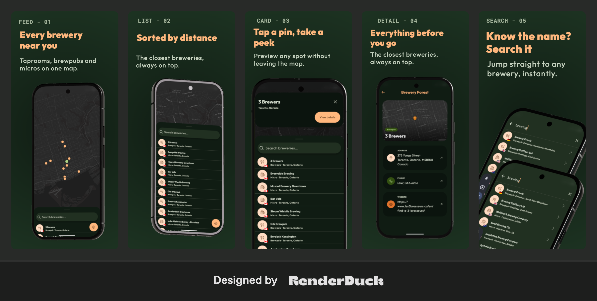

# Brewery Forest

A small Flutter app over the [Open Brewery DB](https://www.openbrewerydb.org/)
API: a paginated, distance-sorted brewery list and a detail screen. The home
screen is a full-screen Mapbox map with a draggable sheet holding a debounced
search and the list; tapping a brewery (list row or map marker) opens its detail

<p align="center">
  
</p>


## Running the project

**Requirements:** Flutter 3.44+ / Dart 3.12+, an Android device or emulator
(iOS is intentionally not set up - see below)

Runtime config (Mapbox token, Sentry DSN, environment) is injected with
`--dart-define-from-file`, not hardcoded. `env/local.example.json` ships with a
working Mapbox token so it runs out of the box

```bash
flutter pub get
make build
make run-debug
```

To use your own keys, copy the example to `env/local.json` (git-ignored) and edit:

```jsonc
{
  "APP_ENV": "local",
  "MAPBOX_ACCESS_TOKEN": "pk.your_token_here",
  "SENTRY_DSN": "https://<key>@<org>.ingest.sentry.io/<project>"
}
```

`MAPBOX_ACCESS_TOKEN` and `SENTRY_DSN` are required - an empty value makes `Env`
throw at startup by design, so a misconfigured build fails fast instead of silently

## What I completed

**Core requirements**

1. **Brewery list** - name, type, city; loading / error / empty states; server-side
   pagination with infinite scroll and a sentinel footer. No silent failures
2. **Brewery detail** - fetch by id; name, address, phone, website (with external
   launch); loading / error / not-found states
3. **Architecture** - Domain / Data / Presentation. Data layer = datasource ->
   repository -> DTO->entity mapper; business logic = `Cubit`/`Bloc` with `freezed`
   sealed states; DI via `get_it` + `injectable`, with no service locator called from
   widgets (`getIt` appears only in the router)
4. **Error handling** - repositories throw typed `AppEx`/`DomainEx`; cubits convert
   them to user-facing states
5. **Testing** - a `FeedCubit` test covering Loading -> Success / Loading -> Error with a
   mocked repository (`mocktail`), plus an end-to-end **Maestro** suite (13 flows) over
   the happy paths and the error/empty states

**Bonus** - I made **Distance** the primary one, and also
did **Map** and **Search with debounce** (all three are from the bonus list):

- **Distance** - `geolocator` for the device position, sorted server-side via
  `by_dist=lat,lng`, resolved once per screen
  session and reused across pages; IP-geolocation fallback when GPS is denied
- **Map** - full-screen Mapbox with a marker per brewery and tap-to-open
- **Search with debounce** - a separate `SearchBloc` (300 ms `debounce` +
  `restartable` via `bloc_concurrency`, plus a Dio `CancelToken`)

## What I intentionally left out

- **iOS** - Android-only; the iOS side is
  deliberately not set up
- **Offline cache** - the fourth bonus option; not implemented
- **Full test coverage** - out of scope

## Trade-offs

- **Mapbox `3.0.0-alpha.1`** - the latest stable (2.x) hardcodes `compileSdk 35`,
  which clashes with the Android lifecycle plugin required by current stable Flutter.
  The alpha is a documented, accepted risk.
- **Three bonuses instead of one** - Distance
  is the primary one; Map and debounce share the same location/data work and were
  well-scoped, so I kept them rather than leave them half-done
- **`flutter_test` + `mocktail` instead of `bloc_test`** - `bloc_test` pulls in the full
  `test` package, whose `analyzer` pin conflicts with the `freezed` 4 prerelease this
  project needs on Dart 3.12
- **Location re-request from the feed** - the locate button re-prompts for permission only
  when the OS still allows it. A permanent denial (`deniedForever`) or disabled location
  services can't be re-prompted programmatically - the system dialog never reappears and
  Settings is the only path - so the button re-asks on a recoverable `denied` and is a
  deliberate no-op otherwise, leaving the IP-approximate fallback that already keeps the app
  usable

## What I would improve with more time

1. **Wider test coverage** - the detail cubit, `SearchBloc`, and the pagination /
   IP-fallback paths (the `FeedCubit` happy + error paths are covered today)
2. iOS setup
3. Offline cache
4. A "Location is off -> Open Settings" affordance on the feed for the `deniedForever` case
   (the locate button no-ops there today; `openAppSettings()` already exists in the
   onboarding cubit)

